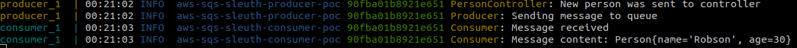

# Springboot AWS SQS Sleuth POC
[](https://travis-ci.org/robsonbittencourt/springboot-aws-sqs-sleuth-poc)

This project is a POC (Proof of Concept) of tracing log through a message broker. The goal is have an id in log generated in first application (consumer) and the same id showed in log of second application (producer). This makes it easier to troubleshooting.

The applications use the [Spring Cloud projects](https://spring.io/projects/spring-cloud). And the message broker used is the [SQS service (Simple Queue Service)](https://aws.amazon.com/sqs/) from Amazon Web Services.

## Learnings

- Following the Spring Cloud AWS and Sleuth documentation, implementing the proposed problem seemed simple. However, contrary to what they seem to understand, things don't work out of the box. It is possible that it is a failure of my understanding, but I had to research a lot to get to the solution described in this POC. If you find any flaws in my approach, or know of another way to resolve this issue, please open a PR.

- The trace information generated by Sleuth, is not propagated by producer automatically. It is necessary to add instrumentation with Brave so that the trace is added to the message. Thanks to [@devinsba](https://github.com/devinsba) for [the only answer](https://github.com/spring-cloud/spring-cloud-sleuth/issues/1550#issuecomment-589686583) I found.

- Aws Auto Configure dependency is very annoing if you use only SQS and not another AWS services. It is necessary to disable some checks that are made so that no errors occur. Strictly follow the settings contained in the application.yml to avoid problems. In addition one of these disables must be done through @EnableAutoConfiguration. See [this class](src/main/java/com/rbittencourt/awssqssleuthconsumerpoc/AwsSqsSleuthConsumerPocApplication.java). Thanks to [@borehack](https://github.com/borehack) for [the tip](https://github.com/spring-cloud/spring-cloud-aws/issues/110#issuecomment-213905695).


## Running

This project has two applications. A producer, who receives a person via API Rest and sends the request to a queue. The other application is the consumer that consumes the message posted in the queue and displays it on the screen. The logic is very simple. The only objective is to demonstrate how the trace id can be propagated between applications that communicate through queues.

```
# Clone the project

git clone git@github.com:robsonbittencourt/springboot-aws-sqs-sleuth-poc.git

# Run apps using docker-compose. Add your AWS credentials keys, and the name of your queue in SQS

AWS_ACCESS_KEY_ID=xxx AWS_SECRET_ACCESS_KEY=xxx AWS_REGION=us-east-1 QUEUE_NAME=test docker-compose up

# In another terminal use this command to sendo a person to api and see the logs

curl --header "Content-Type: application/json" \
     --request POST \
     --data '{"name":"Robson","age":"30"}' \
     http://localhost:8080/person

```

In green the trace id propagated between applications


